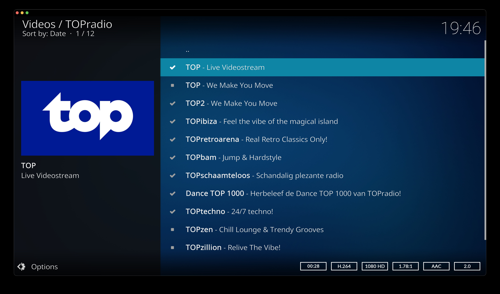
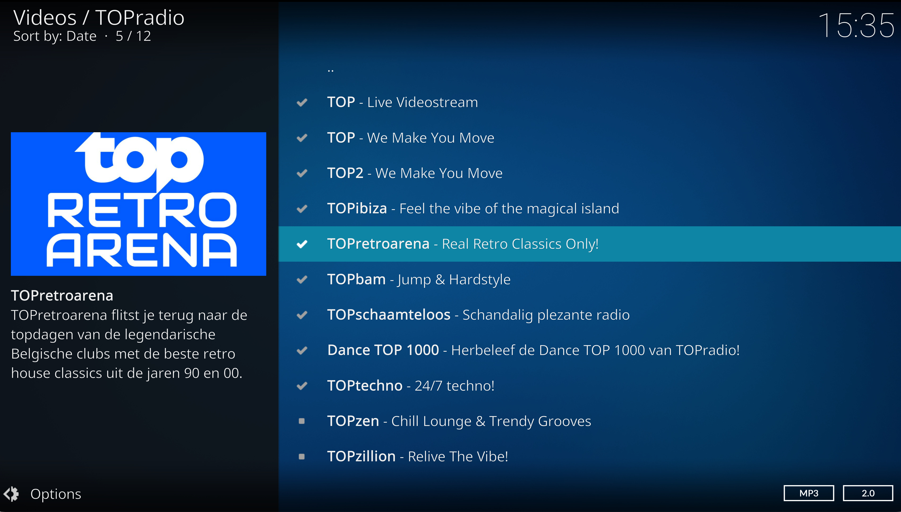
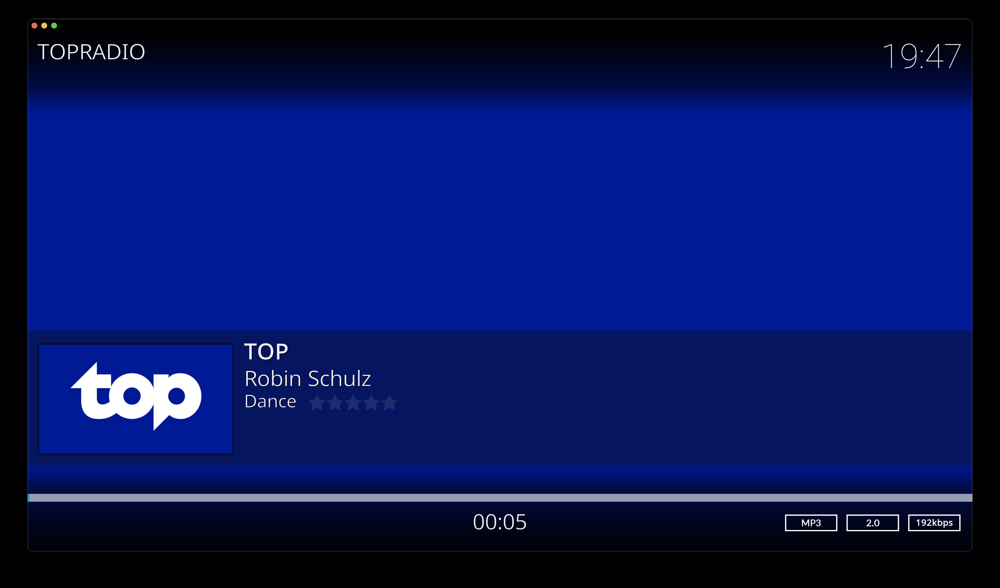

# TOPradio Kodi Add-on

**plugin.video.topradio.be** is an unofficial [Kodi](https://kodi.tv/) add-on that enables you to watch and listen to all live [TOPradio](https://topradio.be/) streams directly from your Kodi media center.

Whether you’re tuning in for music, live shows, or video streams, this add-on brings the full TOPradio experience to your TV.

## Features

- Watch live TOPradio video streams
- Listen to live audio streams
- Simple and lightweight integration with Kodi
- Optimized for a smooth lean-back experience

## Installation

1. Download the latest release of the add-on (ZIP file) from the [Releases page](https://github.com/studiojw/plugin.video.topradio.be/releases/latest)
2. Open Kodi
3. Go to **Add-ons**
4. Select **Install from ZIP file**
5. Locate and select the downloaded ZIP file
6. Wait for the installation confirmation

The add-on will now be available in your video add-ons.

## Screenshots

  
  
  

## Disclaimer

This is an unofficial add-on and is not affiliated with or endorsed by TOPradio. All content is provided through publicly available streams.
